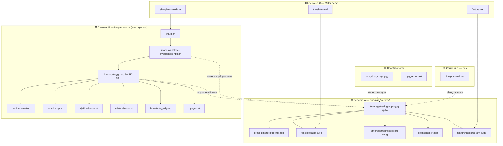

# Контент-архитектура byggexp.no (Норвегия) — семантическая, под сегменты трафика

Цель: не «куча статей», а **топикальная структура** hub-and-spoke, где каждый сегмент трафика ведёт к продукту по своей воронке. Google видит тематический авторитет, пользователь — понятный путь.

## 1. Сегменты трафика (интент × аудитория)

| # | Сегмент | Аудитория | Интент | Воронка | Главный CTA |
|---|---|---|---|---|---|
| **A** | Продукт-поиск (verktøy) | Владелец/админ byggefirma | Коммерческий — найти app/system | MOFU→BOFU | **Prøv gratis / bestill demo** |
| **B** | Регуляторика & compliance | Byggherre / arbeidsleder | Информационный — обязанности | TOFU | Мягкий: «digital oversikt» → A |
| **C** | Maler & verktøy | Малые firma / håndverker | Транзакционный — скачать | MOFU (lead) | **Last ned** + «gjør det i appen» |
| **D** | Pris & kostnad | Forbruker + B2B | Информационный — сколько стоит | TOFU | «Fang alle timene» → A |
| **E** | Hvordan-gjøre (oppgaver) | Arbeidstaker / admin | Транзакц.-инфо | TOFU→MOFU | Ссылка в hub B/A |

Логика: **B — крупнейший трафик (HMS-kort 1K-10K)**, но слабый product-intent → работает как TOFU-охват и мост к A. **A** — деньги. **C/D** — lead/awareness → A.

## 2. Хабы (pillar'ы) → споки

## 3. Правила перелинковки (обязательны в каждой статье)
1. **Вверх:** спок → свой pillar (1 ссылка, в intro и в «Kom i gang»).
2. **Вбок:** 2-3 ссылки на соседние споки того же хаба.
3. **Мост:** 1 ссылка в смежный хаб по смыслу (B↔A через «oppmøte», P→A через «timer→margin», C→ topic-hub).
4. **Вниз (CTA):** 1 главный CTA по сегменту (A: demo; C: last ned; B: мягкий «digital oversikt»).
5. Pillar линкует на ВСЕ свои споки (в «Relaterte guider»).

## 4. CTA-стратегия по сегментам (не путать!)
- **A (продукт):** «Bestill demo / prøv gratis i appen» — прямой.
- **B (регуляторика):** НЕ продавать в лоб. «Trenger du oversikt over hvem som er på plassen? → mannskapsliste/timeregistrering». Мост, не продажа.
- **C (maler):** «Last ned malen» (магнит) + «slipp dobbeltarbeidet — gjør det i appen».
- **D (pris):** «Sørg for at alle timene blir fakturert → timeregistrering».

## 5. Инвентарь: 20 статей разложены по хабам
- **A (6):** timeregistrering-app-bygg, gratis-timeregistrering-app, timeliste-app-bygg, timeregistreringssystem-bygg, stemplingsur-app, faktureringsprogram-bygg
- **B (9):** hms-kort-bygg, bestille/pris/sjekke/mistet/gyldighet-hms-kort, byggekort, mannskapsliste-byggeplass, sha-plan
- **C (3 магнита):** timeliste-mal, fakturamal, sha-plan-sjekkliste
- **D (1):** timepris-snekker
- **Прод/økonomi (2):** prosjektstyring-bygg, byggekontrakt

## 6. Дыры/roadmap (по приоритету)
1. **B-хаб добить:** `byggherreforskriften` (пояснитель-pillar, связывает mannskapsliste+SHA+HMS), `oversiktsliste` (как отдельный спок mannskapsliste).
2. **A-хаб:** `timeregistrering-for-ansatte` / `for-sma-bedrifter` — если 50-vol варианты не выстрелят одной страницей.
3. **D-хаб расширить:** `timepris-rorlegger` / `timepris-elektriker` / `timepris-maler` — если объём подтвердится (проверить в Planner).
4. **C-хаб:** `tilbudsmal` (оффер-шаблон) как магнит к byggekontrakt.
5. **Мосты:** дошить cross-hub ссылки B↔A на всех B-страницах (сейчас есть, усилить анкоры «oppmøte/timer»).

## 7. Принцип на будущее
Каждая новая статья ДО написания отвечает: (1) какой сегмент? (2) какой хаб/pillar? (3) 1 главный ключ + кластер? (4) вверх/вбок/мост-ссылки? (5) какой CTA? Если не вписывается в хаб — не писать (или создать новый хаб осознанно).
